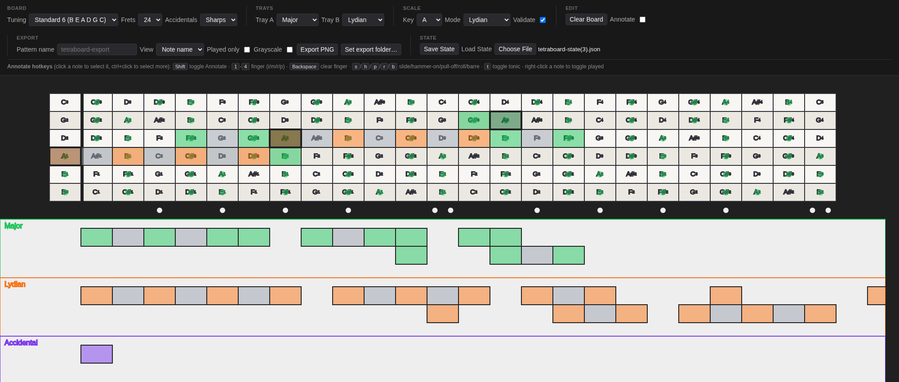
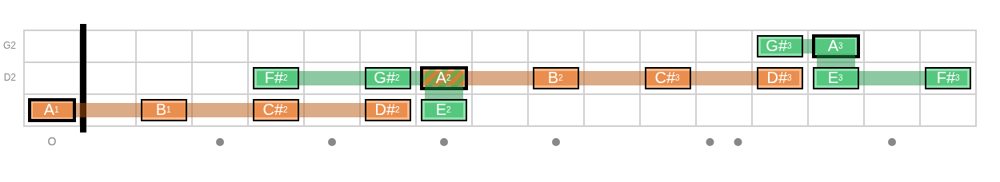
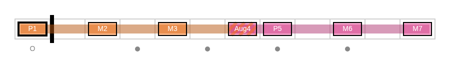

# tetraboard

A browser-based editor for building fretboard-pattern diagrams out of
music-theory-correct tetrachord shapes, then exporting them as clean
PNGs for tab/chart sheets. Runs entirely client-side (Pyodide/PyScript
+ Sketchingpy) -- no backend, no build step, just static files.



**[Try it live](https://gondeknp.github.io/tetraboard/)** -- or run it
locally (see [Getting started](#getting-started)) if you want to edit it.

## What it does

Drag a tetrachord shape (Major, Minor, Phrygian, or Lydian -- pick which
two are on offer via the Tray A/B pickers) out of its tray and drop it
onto the fretboard; it snaps to the grid. Every fingering variant on
offer (`straight`, `right`, `left`, and Lydian's wider `zig`/`open`) is
generated from the mode's actual interval pattern plus your current
tuning, not hand-drawn, so switching tuning or string count re-derives
every shape's fretting automatically.

Stack shapes to build a longer run: two tetrachords that share a root
note snap together into one continuous pattern -- the shared note's
badge and its connecting "pipe" both render as a hatch of each
pattern's own color, so it reads at a glance as "these two shapes are
one pattern," not two unrelated ones that happen to touch. Set a Key
and Mode and turn on Validate to have any out-of-scale note flagged
red immediately, with the tonic auto-highlighted (or overridden by
hand per note, for a pattern that doesn't map cleanly to one key).

Once a pattern is where you want it, switch to Annotate mode to mark
which finger plays each note, which notes are actually played (versus
just part of the underlying shape), and connect notes with
slide/hammer-on/pull-off/roll/barre glyphs. Then export: pick a label
style (note name, interval quality like `Aug4`/`m7`, or fingering),
grayscale or full color, everything or just the played notes -- and
get back a cropped, print-ready PNG.

## Features

- **Configurable board** -- 4/5/6-string bass tunings, up to 30 frets,
  sharp or flat spelling.
- **Two independent mode trays** (Major / Minor / Phrygian / Lydian),
  each offering every fingering shape that mode's interval pattern
  supports in the current tuning, generated on the fly.
- **Shared-note stitching** -- overlapping tetrachords that pivot on a
  common note connect visually (a color-hatched shared badge, a
  same-color connecting pipe along each string), so multi-shape runs
  read as one pattern.
- **Key/Mode-aware validation** -- flags any placed note outside the
  selected key+mode's scale, and auto-highlights (or lets you override)
  the tonic.
- **An "Accidental" tray** for one-off chromatic notes that aren't part
  of either tray's tetrachord.
- **Annotate mode** -- per-note finger numbers, a played/not-played
  toggle, and slide/hammer-on/pull-off/roll/barre connections between
  notes.
- **PNG export** -- vanilla note names, music-theory interval-quality
  labels (`P1`/`M3`/`Aug4`/`dim5`/...), or fingering letters; grayscale
  or full color; all notes or just the played ones; named however you
  like.
- **Save/Load** your whole board (tuning, key, every placed shape,
  annotations, connections) as a JSON file.

## Screenshots

| Note-name export | Interval-quality export |
| --- | --- |
|  |  |

## Getting started

1. Open this folder in VS Code and "Reopen in Container" (or `docker
   build`/`docker run` it yourself -- the Dockerfile has no surprises).
2. Inside the container: `make serve` (or `python scripts/serve.py`).
3. On your host machine, open `http://localhost:8000`. VS Code should
   also offer to forward/open the port automatically.
4. Edit `web/main.py`, save -- the running page hot-swaps it in place,
   no refresh needed. Editing any other file reloads the page.

No `pip install` of Sketchingpy is needed on your machine -- the
browser loads PyScript from the pyscript.net CDN and Sketchingpy (plus
PyYAML, for the mode/shape definitions) from PyPI, both declared in
`web/index.html`.

```
make lint        # ruff, checks web/
make typecheck   # mypy, checks web/
```

## Why this shape

The app runs entirely client-side, so the dev container only needs to
host plain static files -- no GUI passthrough, no X11 forwarding, no
pygame. `web/index.html` + `web/main.py` are served as-is; you edit,
refresh (or, for `main.py`, don't even need to), done.

This also sidesteps a pointer-offset bug hit early on in an online
Sketchingpy editor, which came from the canvas being squeezed into a
resizable split-pane with its own CSS scaling. Here the canvas renders
at native size in a plain page, so clicks line up 1:1. If it ever
drifts, flip `DEBUG_POINTER = True` in `main.py` for a crosshair that
shows exactly where Sketchingpy thinks your pointer is.

`master` auto-deploys to GitHub Pages on every push (see
`.github/workflows/deploy-pages.yml`) -- that's what's running at the
live link above.

## Where things live

- `web/main.py` -- the whole app: canvas setup, drag/drop, annotate
  mode, scale validation, and PNG export all live here.
- `web/fret.py` / `web/open_string.py` / `web/fretboard.py` -- the
  fretboard grid itself (a `Fretboard` is `OpenString`s, each made of
  `Fret`s).
- `web/modes.yaml` / `web/modes.py` -- the mode/tetrachord/fingering-
  shape data and the rule that generates a shape's frets from a mode's
  interval pattern plus the current tuning.
- `web/config.py` -- shared layout/music-theory constants and helpers
  (chromatic scales, scale-degree/interval math, tuning-agnostic
  string-interval math).
- `web/export_style.py` -- every color/inset/font-size knob the PNG
  export uses, kept separate from the export's drawing *logic* in
  `main.py`.
- `web/controls.py` / `web/index.html` -- the plain-HTML control panel
  and the one module that reads it; see `DEVELOPING.md` for how the two
  sides talk to each other.
- `web/devreload.py` / `scripts/serve.py` -- the hot-reload dev loop.

See `DEVELOPING.md` for the deeper architecture notes (why
`controls.py` isn't hot-reloaded, how the control panel wires up to
canvas code, etc), and `PLAN.md` for the running, dated log of every
feature added and why -- useful if you want the reasoning behind a
particular piece of behavior, not just the code.
